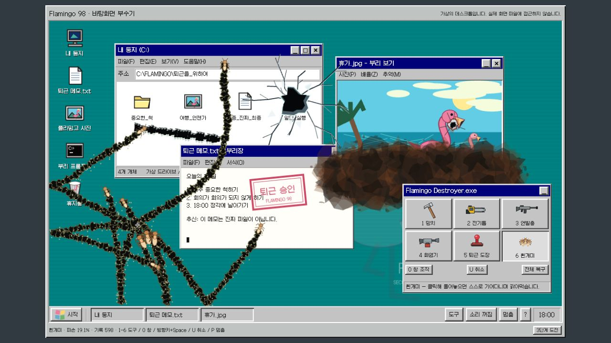

# 실제 브라우저 검수

2026-09-07 · 로컬 4205 · Chromium 기반 브라우저 1280×720. 실제 포인터·키 입력으로 수행했으며 목표 수치·게임 상태를 주입하지 않았습니다.

## 자유 모드

- 망치 클릭의 유리 균열·파편, 전기톱 드래그의 연속 절단, 연발총 탄흔, 화염과 누적 그을음, 퇴근 승인 도장, 흰개미의 자율 이동·갉기 흔적을 각각 확인했습니다.
- 빠른 도구 전환 시 이전 클릭이 사라지던 문제를 수정했습니다. 실제 `5 → 도장 클릭 → 3 → 총 클릭 → 1`의 빠른 순서에서도 도장과 탄흔이 모두 남았습니다. 즉시 취소 입력은 별도 회귀 테스트를 추가했습니다.
- 전체 복구로 파손·기록 0으로 복원됩니다. 0 창 조작 모드, 메모 제목 드래그에 따른 실제 창 위치 변경, 사진 창 최소화 후 작업 표시줄 복원을 확인했습니다.
- P 정지 후 파손 19.1%·기록 601이 후속 확인에서도 유지됐습니다. 계속하기로 재개할 수 있습니다.
- 위 이미지는 망치·톱·도장·총·불·흰개미를 직접 사용한 화면입니다. 생성된 가상 UI 목업이나 CPU 렌더가 아닙니다.

## 실제 세 단계 도전 완주

1. 45초 도전: 빨간 표적 세 곳을 망치로 클릭하고 톱으로 드래그해 첫 단계 통과.
2. 55초 도전: 표적 세 곳에 도장을 찍고 화염기로 그을음을 만들어 두 번째 단계 통과.
3. 65초 도전: 흰개미를 풀고 서로 다른 지점에 총 25회 클릭. 자율 갉기와 파손 8.0% 달성 후 **퇴근 승인 / 세 단계 모두 통과했습니다** 결과를 확인했습니다.

첫 검수에서 결과 뒤 최종 HUD가 한 프레임 전 수치(7.9%)로 남는 문제를 발견했습니다. 종료 상태에서도 HUD를 갱신하도록 수정했고, 실제 첫 단계를 다시 통과하여 **표적 3/3 · 절단 278/250px**의 최종 수치가 결과 화면 뒤에 유지되는 것을 확인했습니다. 최종 승리 7.9→8.0 표시 경로는 실제 production updater를 실행하는 CPU 회귀 검사도 통과했습니다.

## 경계

27개 CPU 테스트와 프로덕션 빌드 통과. 브라우저 경고·오류 로그 0건. 실제 모바일 기기·다중 터치·오디오 청취·장시간 성능은 미검증입니다. 이 게임은 가상 창만 조작하며 실제 OS·파일·화면에 접근하지 않습니다.
